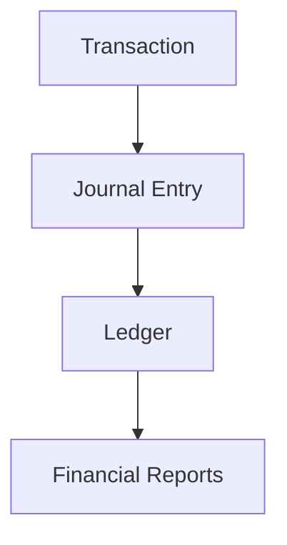

# KasFlow PRD v3.0 - Implementation Notes

## Prinsip Utama

PRD menetapkan **Ledger First Architecture**:

Konsekuensi implementasi:

- `journal_entries` adalah source of truth.
- Dashboard/laporan tidak membaca nominal langsung dari transaksi.
- Setiap transaksi harus menghasilkan jurnal debit/kredit yang balance.
- Closed accounting period harus mengunci transaksi, jurnal, dan laporan.

## Mapping Requirement ke Implementasi

| PRD Area | Implementasi Awal |
| --- | --- |
| Dashboard | `app/page.tsx` KPI + charts dari jurnal |
| Transaction Module | `app/transactions/page.tsx` + `generateJournalFromTransaction` |
| Accounting Module | `app/accounting/page.tsx` journal, ledger, COA, opening balance, closing |
| Master Data | `app/master-data/page.tsx` categories, cash accounts, customers, suppliers |
| Reports | `app/reports/page.tsx` gross revenue, P&L, balance sheet, cash flow |
| Tax Module | `app/tax/page.tsx` dynamic settings + monthly/annual estimation |
| Onboarding | `app/onboarding/page.tsx` 3-step wizard |
| Dummy/Seed/Reset | `app/utilities/page.tsx` |
| Audit Log | Stored in Zustand + surfaced in Accounting |
| Recycle Bin | Soft-deleted transactions/customers/suppliers in Utilities |
| Security | `firestore.rules` + `storage.rules` |
| Server Aggregation | `functions/src/index.ts` callable `aggregateDashboard` scaffold |

## Next Recommended Milestones

1. Firebase Authentication UI and session handling.
2. Firestore sync layer for all collections.
3. Real CRUD screens for COA/categories/cash accounts/customers/suppliers.
4. Report pagination and server-side aggregation integration.
5. Backup restore upload parser and ZIP export.
6. Role enforcement in UI and rules.
7. Tests for accounting journal/report calculations.
