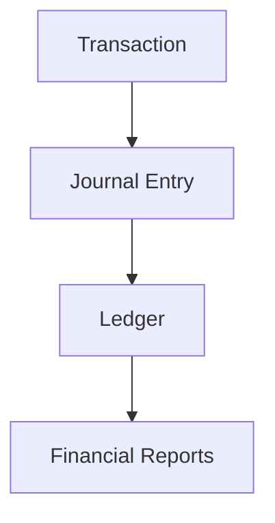
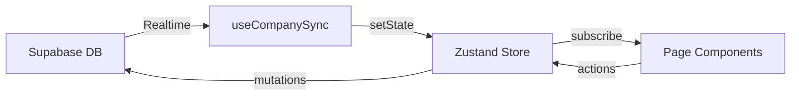

# KasFlow — Implementation Notes

> See full PRD: [`docs/PRD.md`](./PRD.md) | Schema: [`supabase-schema.sql`](../supabase-schema.sql)

## Architecture Principle

- `journal_entries` is the **source of truth** for all reports.
- Dashboard/laporan do NOT read amounts from `transactions`.
- Every transaction produces balanced debit/credit journal lines.
- Closed accounting periods lock transactions, journals, and reports.

## Module → File Mapping

| Module | Page | Key Logic |
|--------|------|-----------|
| Dashboard | `app/page.tsx` | `calculateReportSummaryMemo`, `calculateCashFlowMemo`, `topAccountsByType` |
| Transactions | `app/transactions/page.tsx` | `generateJournalFromTransaction`, `usePaginatedTransactions` |
| Accounting | `app/accounting/page.tsx` | `buildLedgerEntries`, `generateClosingEntries`, `createOpeningBalanceJournal` |
| Master Data | `app/master-data/page.tsx` | Categories, cash accounts, customers, suppliers CRUD |
| Reports | `app/reports/page.tsx` | `calculateProfitLossMemo`, `calculateBalanceSheetMemo`, `calculateCashFlowMemo` |
| Tax | `app/tax/page.tsx` | `calculateTaxReportMemo` |
| Utilities | `app/utilities/page.tsx` | Seed, dummy data, reset, backup/restore |
| Settings | `app/settings/page.tsx` | Business profile CRUD |
| Marketplace | `app/integrations/page.tsx` | TikTok Shop OAuth, statement sync, approval workflow |
| Onboarding | `app/onboarding/page.tsx` | `bootstrapCompanyForUser` |

## Data Flow

1. `useCompanySync` (in `app-shell.tsx`) fetches all tables on mount + subscribes to Realtime
2. Journal entries, ledger entries loaded in initial parallel batch
3. Pages subscribe to Zustand store selectors
4. User actions call store methods or `company-service.ts` functions
5. Server-side mutations trigger Realtime events → store auto-updates

## Performance Optimizations

- **Parallel fetch:** All 8 critical tables fetched in single `Promise.all` during `loadAll`
- **Deferred fetch:** Customers, suppliers, audit logs loaded in second batch
- **Memoized calculations:** `useMemo` + custom `memoize()` for report computations
- **Partialize:** Transactions, journal entries, ledger excluded from localStorage
- **Incremental ledger:** `appendLedgerEntries()` for new transactions (O(1) vs full rebuild)
- **Server-side pagination:** Transactions use cursor-based pagination (50 per page)
- **Debounced search:** 300ms debounce on transaction search input

## Completed Milestones

1. ✅ Supabase Auth integration (email + password)
2. ✅ Realtime sync for all 18 tables
3. ✅ Full CRUD for COA, categories, cash accounts, customers, suppliers
4. ✅ Financial reports: P&L, Balance Sheet (PMSAK), Cash Flow
5. ✅ Period closing with closing entries + Laba Ditahan
6. ✅ Capital transactions (setoran modal, prive, dividen)
7. ✅ TikTok Shop marketplace integration with approval workflow
8. ✅ CSV export for reports
9. ✅ Backup/restore (JSON)
10. ✅ Infinite scroll for transactions

## Recommended Next Milestones

1. Multi-platform marketplace support (Shopee, Tokopedia)
2. Modern visualization alternatives (diverging bar chart, sparkline cards)
3. Role-based UI enforcement (owner vs accountant vs staff)
4. Report pagination and server-side aggregation
5. Automated test suite for accounting calculations
6. Progressive Web App (PWA) offline support
7. Multi-currency support
8. Invoice/receipt generation
